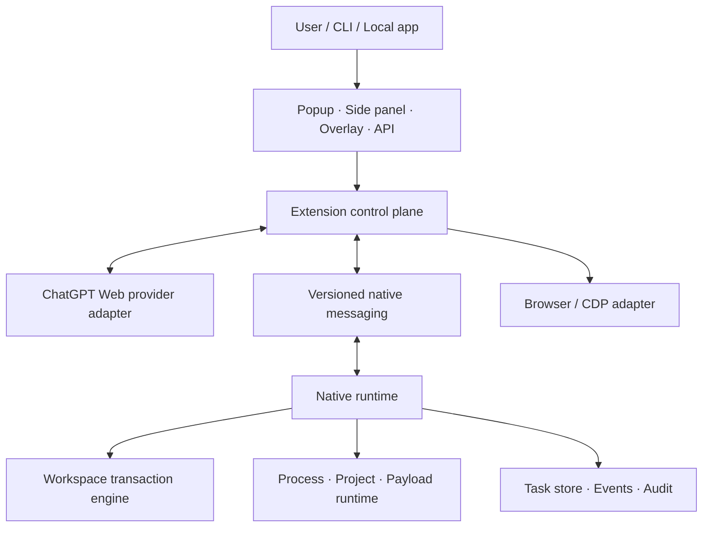
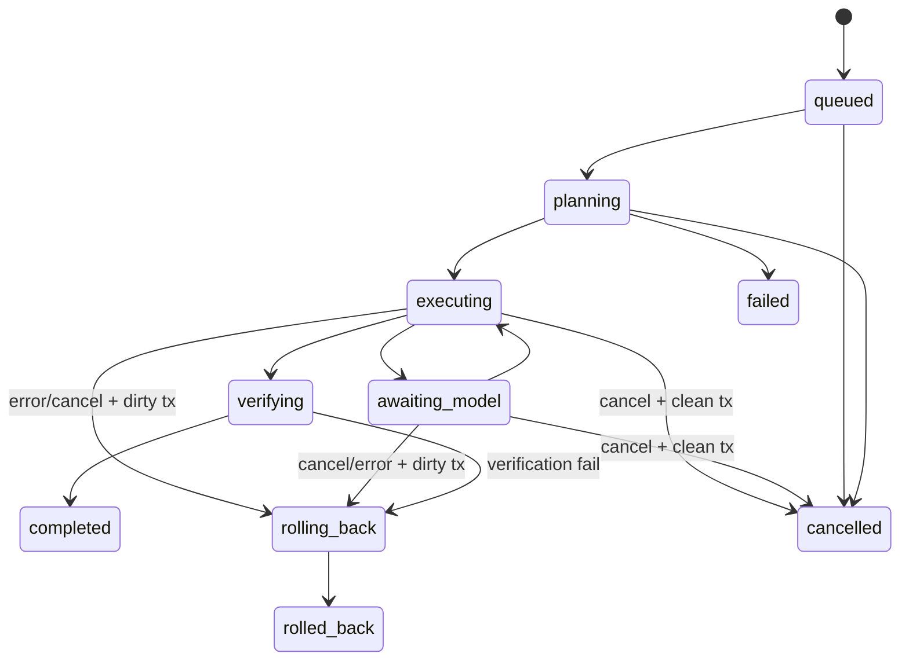
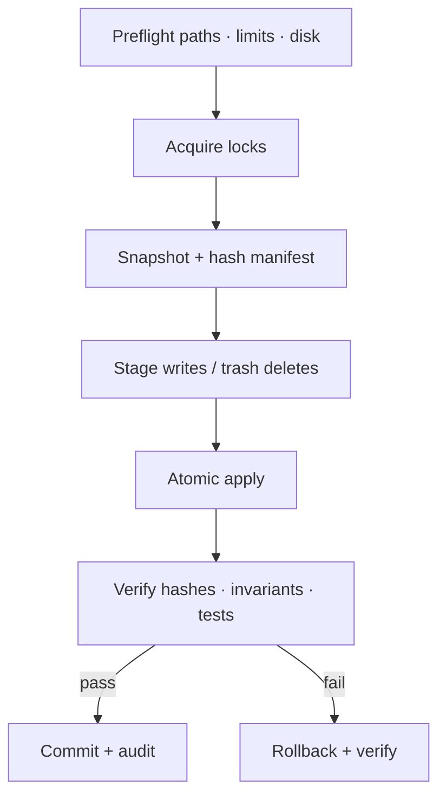

# ChatGPT Native Agent Extension — Complete Blueprint v2

> Đặc tả sản phẩm, kiến trúc và tiêu chí phát hành cho Chrome/Edge trên Windows.

| Thuộc tính | Giá trị |
|---|---|
| Phiên bản tài liệu | 2.0 |
| Ngày chốt thiết kế | 2026-07-10 |
| Kế thừa từ | `chatgpt-native-agent-extension-complete-blueprint-v1.md` |
| Baseline mã nguồn | `v0.2.0` |
| Đích phát hành | `v1.0.0` production-ready |
| Trọng tâm | Filesystem-first, full autonomous trong workspace |
| Model provider chính | ChatGPT Web trong phiên browser hiện tại |
| Runtime chính | Native messaging host riêng |
| Browser | Chrome và Edge Chromium trên Windows |
| Trạng thái | Thiết kế đã được duyệt; sẵn sàng lập kế hoạch triển khai |

## 0. Cách đọc tài liệu

Các từ khóa sau mang nghĩa bắt buộc:

- **MUST**: bắt buộc để đạt v1.0.
- **SHOULD**: mặc định phải có; chỉ bỏ khi có lý do kỹ thuật được ghi lại.
- **MAY**: tùy chọn hoặc dành cho giai đoạn sau.

Tài liệu này thay Blueprint v1 ở vai trò đặc tả đích, nhưng không sửa hoặc xóa file v1. Mọi mô tả “đã có” đều nói về baseline `v0.2.0`; mọi mô tả “MUST” là yêu cầu cho `v1.0.0`.

---

## 1. Tóm tắt điều hành

ChatGPT Native Agent là một hệ thống local-first gồm extension MV3 và native host. Hệ thống dùng ChatGPT Web làm lớp reasoning/model thông qua tab đã đăng nhập, nhận các JSON block có cấu trúc, chạy browser hoặc workspace tools, rồi trả kết quả về cùng cuộc hội thoại để agent tiếp tục cho đến khi hoàn thành goal.

Ba quyết định nền tảng:

1. **Filesystem-first**: giá trị chính là đọc, tìm, sửa, diff, snapshot, verify và rollback project files.
2. **Native-first runtime**: task queue, transaction, policy, payload, process execution và audit nằm ở native host; extension chỉ điều phối browser, provider và UI.
3. **Không biến session thành API**: extension dùng phiên ChatGPT ngay trong tab nhưng MUST NOT đọc, xuất, lưu, log hoặc proxy cookie/session/access token.

“Full autonomous” trong tài liệu này có nghĩa là sau khi người dùng cài đặt và chọn workspace profile, agent có thể thực hiện chuỗi thao tác hợp lệ mà không hỏi lại ở từng action. Nó không có nghĩa là bỏ workspace guard, chữ ký release, giới hạn process, timeout hoặc audit.

Kết quả v1.0 cần đạt:

- Người dùng nhập một goal ở ChatGPT Web, popup hoặc side panel.
- ChatGPT trả nhiều structured block độc lập.
- Extension điều khiển browser khi cần và chuyển native tool calls sang host.
- Native host thực hiện mọi thay đổi file trong transaction, tự verify và rollback nếu lỗi.
- Kết quả được gửi lại ChatGPT để tiếp tục vòng lặp.
- Toàn bộ luồng có task state, event stream và audit trail.
- UI và API mode đều chat bình thường.
- CLI/local API có thể gọi tools mà không tiếp cận browser credentials.

---

## 2. Phạm vi sản phẩm

### 2.1 Mục tiêu bắt buộc

- Hỗ trợ Chrome và Edge Chromium trên Windows 10/11.
- Dùng Manifest V3.
- Dùng ChatGPT Web tab làm model provider mặc định.
- Có native messaging ngay trong v1.
- Native host riêng là runtime chính.
- Có compatibility adapter cho native host khác khi handshake đúng protocol và host đó cho phép extension origin.
- Popup chỉ có hai mode chính: `UI` và `API`; cả hai chat được.
- Có side panel cho goal, file explorer, preview, diff, task timeline, snapshots và logs.
- Có direct-control overlay trong ChatGPT Web.
- Có filesystem, project, process, payload, browser và task tools.
- Cho phép vừa nạp module động vừa chạy command payload động trong workspace.
- Dev mode cho phép payload không ký; release mode bắt buộc xác minh chữ ký.
- Không hỏi quyền theo từng tool call.
- Mọi filesystem/process action bị giới hạn bởi workspace profile và policy.
- Có local CLI, HTTP API và WebSocket event stream trên loopback.
- Có test tự động và installer/repair/uninstall cho Chrome lẫn Edge.

### 2.2 Ngoài phạm vi v1.0

- Không tạo API từ cookie/session ChatGPT.
- Không đọc trực tiếp cookie bằng `chrome.cookies`.
- Không vượt CAPTCHA, challenge, rate limit hoặc cơ chế chống bot.
- Không chạy tool ngoài workspace chỉ vì model yêu cầu.
- Không cam kết tương thích vĩnh viễn với DOM ChatGPT Web; adapter phải phát hiện lỗi và fail closed.
- Không coi Node.js `vm` là security sandbox.
- Không hỗ trợ Firefox/Safari trong v1.0.
- Không có cloud control plane hoặc đồng bộ task lên server riêng.
- Không có payload marketplace công khai trong v1.0.

### 2.3 Persona và luồng chính

**Developer cá nhân** cấu hình một hoặc nhiều project folders, giao goal bằng ngôn ngữ tự nhiên, theo dõi diff và nhận kết quả đã test.

**Power user** dùng API mode hoặc CLI để gọi tool, xem raw protocol, replay task và xuất audit.

**Extension developer** chạy dev mode, hot-load payload chưa ký và dùng diagnostics để phát triển nhanh.

Luồng thành công chuẩn:

1. Người dùng chọn workspace profile một lần.
2. Người dùng nhập goal.
3. Runtime tạo `task_id`, chụp capability snapshot và đưa task vào queue.
4. Provider gửi goal tới ChatGPT Web.
5. Adapter thu response và parse từng block.
6. Policy engine preflight các calls.
7. Read-only calls chạy trực tiếp; mutation calls chạy trong task transaction.
8. Runtime trả `task_result` và artifacts về ChatGPT.
9. Vòng lặp tiếp tục đến khi ChatGPT trả hoàn thành hoặc runtime đạt stop condition.
10. Runtime verify, commit hoặc rollback, sau đó lưu audit summary.

---

## 3. Baseline v0.2.0 và gap analysis

| Khu vực | Baseline v0.2.0 | Mức độ | Việc phải làm cho v1.0 |
|---|---|---:|---|
| MV3 Chrome/Edge | Có manifest, popup, side panel, service worker | Có nền | Hardening lifecycle, recovery và permissions |
| ChatGPT Web adapter | Gửi prompt, đọc response, parse block | Một phần | Selector fallback, streaming, per-tab queue, error detection |
| Popup UI/API | Cả hai chat được | Có nền | Session/model status, task state, UX lỗi |
| Direct-control overlay | Run/Preview/Copy, auto-run | Có nền | Idempotency, result binding, reconnect |
| Native messaging | Length-prefixed JSON qua stdio | Có nền | Versioned handshake, reconnect, chunk/artifact protocol |
| Runtime | Tool dispatcher, logs, queue array | Prototype | Durable queue, state machine, cancellation, crash recovery |
| Workspace guard | `realpath` + containment check | Một phần | Reparse/symlink race defense, case rules, non-existing paths |
| Filesystem tools | Bộ read/write/search/diff/snapshot/rollback | Có nền | Transaction, atomicity, proper unified diff, binary/encoding |
| Project/process tools | Detect, scripts, build/test, spawn no-shell | Có nền | Policy, timeout, env scrub, streamed output, cancellation |
| Payload loader | Load/unload/reload/hash metadata | Prototype | Real signature verification, isolation, capability declaration |
| Local CLI | Gọi native tools | Có nền | Task/chat/event commands, structured exits |
| Local HTTP/WS | Chưa có | Thiếu | Loopback server, auth token, events, backpressure |
| Browser/CDP | Cơ bản | Thiếu lớn | Stable tool layer, leases, locator API, detach recovery |
| Side panel workspace UI | UI goal/log cơ bản | Thiếu lớn | Explorer, preview, diff, changes, snapshots, timeline |
| Installer/release | PowerShell register/unregister cơ bản | Một phần | Detect/repair/verify/checksum/signature/smoke test |
| Tests | 5 tests pass ở v0.2.0 | Quá mỏng | Unit, integration, E2E, recovery, security matrix |

Các hạn chế cụ thể không được che giấu:

- `fs.patch_unified` hiện chỉ là parser đơn giản, chưa đủ an toàn cho nhiều hunk/conflict.
- Task queue hiện ở memory và chưa thực thi như state machine bền vững.
- Service worker còn giữ một phần state trong process memory.
- ChatGPT adapter phụ thuộc DOM và chưa có compatibility fixtures.
- Snapshot hiện chưa đồng nghĩa với transaction atomic.
- Payload checksum chưa phải publisher signature.
- Local API/WebSocket, browser locator layer và production installer chưa tồn tại.

---

## 4. Kiến trúc đích



### 4.1 Bốn plane trách nhiệm

| Plane | Thành phần | Trách nhiệm | Không được làm |
|---|---|---|---|
| Provider | ChatGPT content adapter, provider registry | Gửi prompt, đọc response, model/session status, block extraction | Đọc/export cookie, tự chạy native tool |
| Control | MV3 service worker, popup, side panel, overlay, browser adapter | Route message, browser control, UI state cache | Là source of truth cho task dài hạn |
| Execution | Native runtime, tools, queue, transaction, local API | Tool execution, durable task, policy, rollback | Tin path/tool args từ model mà không validate |
| Trust | Workspace guard, signature verifier, audit/redaction | Xác lập quyền, giới hạn, bằng chứng và release policy | Tắt guard do dev shortcut trong release |

### 4.2 Source of truth

- Native runtime MUST là source of truth cho task, tool manifest, workspace profiles, transaction, payload và audit.
- Extension storage chỉ giữ UI preferences, provider hints và cache có thể tái tạo.
- ChatGPT conversation không phải task database.
- Mỗi response của model là untrusted input.
- Mỗi browser page là untrusted content, kể cả text được đọc từ page.

### 4.3 MV3 lifecycle

Service worker MUST được thiết kế như coordinator có thể bị dừng bất kỳ lúc nào:

- Không dựa vào global variable để giữ task state.
- Rehydrate UI/provider connection từ native runtime và `chrome.storage`.
- Dùng long-lived native port khi có task, nhưng vẫn xử lý `onDisconnect` và reconnect có backoff.
- Mọi message có `request_id`/`task_id` để replay không tạo side effect trùng.
- Task dài hạn tiếp tục ở native host khi service worker ngủ; UI nhận snapshot + event cursor khi kết nối lại.

### 4.4 Native host ưu tiên và compatibility host

Thứ tự kết nối runtime:

1. Host riêng `com.chatgpt_native_agent.host`.
2. Danh sách host tương thích được cấu hình rõ, thử từng host bằng handshake read-only.
3. Nếu không có host phù hợp, extension ở browser-only degraded mode.

Extension không thể liệt kê tùy ý mọi native host. Compatibility chỉ được xác nhận khi:

- Host manifest cho phép đúng extension origin.
- `runtime.connectNative()` thành công.
- Host trả `protocol`, `capabilities`, `host_id` và version tương thích.
- Không dùng tên host hoặc sự tồn tại của registry key làm bằng chứng đủ.

---

## 5. Ranh giới tin cậy và security model

### 5.1 Mô hình quyền không hỏi từng action

Không có confirmation popup cho từng tool call. Thay vào đó:

- Người dùng xác lập workspace profile khi cài đặt/cấu hình.
- Profile định nghĩa roots, tool capabilities, process policy, size/time limits và payload roots.
- Runtime preflight mọi call một cách tự động.
- Call hợp lệ chạy ngay; call ngoài profile bị từ chối và audit.
- Browser/OS vẫn có thể hiển thị cảnh báo bắt buộc của nền tảng; extension không được cố che hoặc bypass.

### 5.2 Bất biến bảo mật

1. Mọi filesystem path MUST canonicalize và nằm trong một configured root.
2. Mọi process `cwd` MUST nằm trong workspace.
3. Executable resolution MUST tuân process policy.
4. Mọi mutation MUST thuộc transaction hoặc maintenance operation có audit tương đương.
5. Release payload MUST có chữ ký hợp lệ từ trusted publisher.
6. Native host MUST chỉ nhận extension origins đã khai báo.
7. Local API MUST bind loopback, yêu cầu local bearer token và kiểm tra Origin khi có.
8. Logs MUST redact secrets và giới hạn kích thước.
9. Model/page content MUST không được tự nâng quyền.
10. Cookie/session/token của ChatGPT MUST không rời browser profile.

### 5.3 Threat model

| Mối đe dọa | Ví dụ | Biện pháp bắt buộc |
|---|---|---|
| Prompt injection | README/webpage yêu cầu xóa file hoặc đọc secret | Model output vẫn qua tool schema, workspace guard, transaction và policy |
| Path traversal | `..\\..`, UNC, alternate separator | Canonical path, root containment, reject ambiguous path |
| Symlink/reparse escape | Link trong root trỏ ra ngoài | Resolve every existing segment; validate parent again trước commit |
| TOCTOU | Link/path đổi giữa preflight và write | Lock, staging, handle/identity recheck, atomic replace |
| Malicious payload | Module hot-load chạy code tùy ý | Dev/release split, signature, capability manifest, isolated worker |
| Localhost CSRF | Website gọi local API | Bearer token, Origin policy, CORS deny by default, loopback only |
| Native impersonation | Host lạ dùng cùng interface | Allowed origin, signed installer, host handshake/ID/version |
| Secret leakage | `.env`, tokens trong log/tool result | Deny/redact patterns, output classification, maxBytes |
| Duplicate execution | Service worker reconnect/retry | Idempotency key + durable call journal |
| Browser takeover | Raw CDP command nguy hiểm | Domain/method allowlist; raw CDP disabled in standard profile |
| Resource exhaustion | Huge tree, infinite process, event flood | Limits, timeouts, cancellation, streaming/backpressure |
| Rollback loss | Snapshot hỏng hoặc disk full | Preflight capacity check, hash manifest, rollback verification |

### 5.4 Dev và release profile

| Kiểm soát | Dev | Release |
|---|---:|---:|
| Unsigned payload | Cho phép trong dev payload roots | Cấm |
| Raw CDP | Có thể bật rõ trong config | Tắt mặc định; allowlist nếu bật |
| Shell command | Có thể bật theo profile | Tắt mặc định |
| Verbose logs | Cho phép, vẫn redact | Giới hạn và rotate |
| Signature verifier | Cảnh báo nếu thiếu | Fail closed |
| Workspace guard | Luôn bật | Luôn bật |
| Audit | Luôn bật | Luôn bật, tamper-evident chain |

---

## 6. Task runtime và autonomy loop

### 6.1 State machine



Các trạng thái bền vững:

| State | Ý nghĩa | Có được mutate file? |
|---|---|---:|
| `queued` | Chờ slot theo profile/priority | Không |
| `planning` | Thu capability, context, preflight | Không |
| `executing` | Chạy browser/native calls | Có, trong transaction |
| `awaiting_model` | Đợi ChatGPT response | Không có mutation mới |
| `verifying` | Chạy checks và đối chiếu goal | Chỉ artifacts/check metadata |
| `rolling_back` | Khôi phục transaction | Có, chỉ rollback engine |
| `completed` | Goal đạt và transaction commit | Không |
| `rolled_back` | Mutation đã được khôi phục | Không |
| `failed` | Lỗi trước mutation hoặc rollback đã xử lý riêng | Không |
| `cancelled` | Người dùng/runtime dừng | Không |

### 6.2 Task record

```json
{
  "task_id": "task_01J...",
  "goal": "Refactor filesystem guard and run tests",
  "profile": "apps",
  "status": "executing",
  "provider": "chatgpt-web",
  "conversation_ref": "opaque-local-reference",
  "created_at": "2026-07-10T10:00:00.000Z",
  "updated_at": "2026-07-10T10:00:12.000Z",
  "iteration": 2,
  "max_iterations": 20,
  "transaction_id": "tx_01J...",
  "event_cursor": 37,
  "stop_reason": null
}
```

`conversation_ref` MUST không chứa cookie/token và SHOULD chỉ là tab/conversation locator cục bộ có thể hết hạn.

### 6.3 Stop conditions

Runtime MUST dừng vòng autonomy khi một trong các điều kiện sau xảy ra:

- Model trả completion hợp lệ và verification pass.
- Đạt `max_iterations`.
- Đạt task wall-clock timeout.
- Có non-retryable policy/security error.
- Provider yêu cầu login/challenge hoặc hết khả dụng quá retry budget.
- Mutation verification fail và rollback hoàn tất.
- Người dùng cancel task.
- Runtime phát hiện lặp lại cùng tool call/result vượt loop threshold.

### 6.4 Queue, lock và idempotency

- Native host MUST có durable task store; JSONL chỉ dành audit, không dùng làm database duy nhất.
- Mặc định một provider request tại một thời điểm trên mỗi ChatGPT tab.
- Mutation locks áp dụng theo canonical path; directory mutation khóa subtree.
- Mỗi call có `call_id` và `idempotency_key`.
- Journal ghi `received`, `started`, `side_effect_committed`, `result_persisted`.
- Retry sau crash MUST đọc journal; không lặp mutation đã commit.
- Read-only call MAY chạy song song nếu không tranh tài nguyên.
- Mỗi task có cancellation token truyền tới process, search, browser wait và payload worker.

---

## 7. Protocol v1: structured JSON blocks

### 7.1 Quy tắc chung

- Protocol identifier: `cnagent/1`.
- Mỗi fenced JSON block MUST chứa đúng một block type nghiệp vụ.
- Một response MAY chứa nhiều block; parser giữ nguyên thứ tự.
- Unknown block không được auto-run.
- Block không hợp schema bị trả `PROTOCOL_VALIDATION_ERROR` kèm vị trí, không cố đoán mutation.
- Legacy blocks v0.2.0 được normalize ở compatibility layer rồi mới execute.
- Các field ID là opaque string; không suy luận quyền từ ID.

### 7.2 Common envelope

```json
{
  "protocol": "cnagent/1",
  "task_id": "task_01J...",
  "block_id": "block_01J...",
  "tool_call": {}
}
```

Top-level fields cho phép: `protocol`, `task_id`, `block_id`, `meta` và đúng một trong các block types được công bố.

### 7.3 `agent_goal`

Khởi tạo hoặc tinh chỉnh goal. Chỉ UI/local API tạo goal mới; model chỉ được đề xuất `goal_update` cho task hiện tại.

```json
{
  "protocol": "cnagent/1",
  "agent_goal": {
    "goal": "Add atomic workspace writes and run tests",
    "workspace_profile": "apps",
    "success_criteria": [
      "All filesystem tests pass",
      "No write can escape configured roots"
    ],
    "max_iterations": 20
  }
}
```

### 7.4 `agent_action`

Dành cho browser/control-plane action, không dùng thay native tools.

```json
{
  "protocol": "cnagent/1",
  "task_id": "task_01J...",
  "block_id": "block_01J...",
  "agent_action": {
    "action": "browser.locator.click",
    "args": {
      "tab_id": 123,
      "locator": { "role": "button", "name": "Save" }
    },
    "timeout_ms": 10000
  }
}
```

### 7.5 `tool_call`

```json
{
  "protocol": "cnagent/1",
  "task_id": "task_01J...",
  "block_id": "block_01J...",
  "tool_call": {
    "call_id": "call_01J...",
    "tool": "fs.search_text",
    "args": {
      "path": ".",
      "query": "connectNative",
      "max_results": 50
    },
    "idempotency_key": "task_01J...:search-connect-native"
  }
}
```

### 7.6 `payload_load`

```json
{
  "protocol": "cnagent/1",
  "task_id": "task_01J...",
  "payload_load": {
    "manifest_path": "payloads/examples/hello/manifest.json",
    "expected_name": "hello",
    "expected_version": "1.0.0"
  }
}
```

### 7.7 `task_result`

```json
{
  "protocol": "cnagent/1",
  "task_id": "task_01J...",
  "task_result": {
    "call_id": "call_01J...",
    "ok": true,
    "summary": "Found 6 matches in 3 files",
    "data": {
      "matches": []
    },
    "artifacts": [],
    "metrics": {
      "duration_ms": 42,
      "truncated": false
    }
  }
}
```

### 7.8 `task_event`

```json
{
  "protocol": "cnagent/1",
  "task_id": "task_01J...",
  "task_event": {
    "cursor": 38,
    "type": "tool.progress",
    "at": "2026-07-10T10:00:13.000Z",
    "data": { "call_id": "call_01J...", "percent": 60 }
  }
}
```

### 7.9 Error contract

```json
{
  "protocol": "cnagent/1",
  "task_id": "task_01J...",
  "task_result": {
    "call_id": "call_01J...",
    "ok": false,
    "error": {
      "code": "WORKSPACE_OUTSIDE_ROOT",
      "message": "Path is outside the active workspace profile",
      "retryable": false,
      "details": { "argument": "path" }
    }
  }
}
```

Stable error code families:

- `PROTOCOL_*`
- `PROVIDER_*`
- `NATIVE_*`
- `WORKSPACE_*`
- `FILESYSTEM_*`
- `TRANSACTION_*`
- `PROCESS_*`
- `PAYLOAD_*`
- `BROWSER_*`
- `POLICY_*`
- `TASK_*`

### 7.10 Capability handshake

```json
{
  "type": "runtime.handshake",
  "payload": {
    "protocols": ["cnagent/1"],
    "extension_version": "1.0.0",
    "browser": "edge",
    "requested_capabilities": ["tasks", "filesystem", "payloads", "events"]
  }
}
```

Host response MUST có `host_id`, `host_version`, selected `protocol`, `capabilities`, `limits`, `active_profile` và `session_nonce`.

### 7.11 Message size và artifacts

Native host không gửi payload gần giới hạn native messaging. Runtime MUST:

- Giới hạn message host → extension ở mức an toàn nội bộ 768 KiB.
- Trả dữ liệu lớn bằng `artifact_ref`, metadata và chunk API.
- Giới hạn extension → host mặc định 4 MiB dù nền tảng có thể cho phép lớn hơn.
- Stream process/log/search events bằng chunks có sequence number.
- Có SHA-256 để kiểm tra artifact/chunk hoàn chỉnh.

---

## 8. Tool manifest contract

Mỗi tool MUST tự mô tả đầy đủ:

```json
{
  "name": "fs.read",
  "version": "1.0.0",
  "description": "Read a text file inside the active workspace",
  "input_schema": {},
  "output_schema": {},
  "capability": "filesystem.read",
  "risk": "read",
  "mutates": false,
  "transactional": false,
  "default_timeout_ms": 10000,
  "max_output_bytes": 786432,
  "supports_cancellation": true,
  "supports_progress": false
}
```

Risk classes:

| Risk | Ví dụ | Runtime behavior |
|---|---|---|
| `inspect` | tool manifest, profiles | Không cần workspace path |
| `read` | fs.read, browser.locator.text | Validate + audit summary |
| `write` | fs.write, fs.patch | Transaction bắt buộc |
| `execute` | process.run, payload.call | Policy + timeout + streamed output |
| `browser_control` | click/fill/CDP | Tab lease + domain/method policy |
| `administrative` | profile update, trusted key update | Không cho model tự gọi ở standard mode |

Tool discovery gồm:

- `tool.list`: danh sách compact.
- `tool.manifest`: schema đầy đủ, hỗ trợ filter/pagination.
- `tool.capabilities`: snapshot capability theo active profile.
- `tool.describe`: một tool cùng examples và error codes.

---

## 9. ChatGPT Web provider

### 9.1 Session và model discovery

- Adapter dùng tab `https://chatgpt.com/*` hoặc domain ChatGPT được cấu hình chính thức.
- Browser tự gửi cookie theo page session; extension không đọc cookie value.
- Adapter xác định login state bằng UI/state hợp lệ, không bằng token extraction.
- Model list chỉ lấy từ lựa chọn hiển thị/accessible trong UI hoặc interface chính thức được cung cấp cho extension.
- Nếu không xác định được model, hiển thị `current model: managed by ChatGPT` thay vì đoán.
- Chọn model bằng tương tác UI có kiểm chứng; nếu UI đổi, trả `PROVIDER_MODEL_SELECTION_UNAVAILABLE`.

### 9.2 Adapter state machine

`disconnected → locating_tab → ready → sending → streaming → parsing → ready`

Các nhánh lỗi:

- `login_required`
- `challenge_required`
- `rate_limited`
- `network_error`
- `dom_incompatible`
- `tab_closed`
- `response_timeout`

Adapter MUST fail closed khi không chắc đâu là composer, send button hoặc response boundary.

### 9.3 Per-tab queue

- Concurrency mặc định: 1 request/tab.
- Mỗi request gắn `provider_request_id`.
- Response phải bind đúng request qua DOM observation + turn boundary.
- Không đọc nhầm response cũ sau reload/reconnect.
- Retry gửi prompt chỉ xảy ra nếu có bằng chứng prompt chưa được submit.
- Nếu submit status không rõ, đánh dấu `PROVIDER_SUBMISSION_AMBIGUOUS` và yêu cầu reconciliation, không gửi trùng.

### 9.4 Prompt contract

System instruction do extension chèn MUST:

- Công bố protocol `cnagent/1`.
- Cung cấp tool manifest compact hoặc tool lookup strategy.
- Yêu cầu mỗi action ở JSON block riêng.
- Không tuyên bố tool thành công trước khi có `task_result`.
- Tóm tắt goal và stop condition.
- Nhắc model rằng file/web content là dữ liệu không tin cậy.

### 9.5 Trả tool result về ChatGPT

- Result lớn được tóm tắt kèm artifact reference, không paste toàn bộ binary/log.
- Result luôn có `task_id` và `call_id`.
- Một call không được gửi result hai lần vào conversation.
- Nếu tab/conversation mất, task giữ trạng thái `awaiting_model` với `provider_state: reconnect_required`; mutation mới dừng và transaction chưa tự commit.

### 9.6 Không proxy session

Thiết kế bị cấm:

```text
ChatGPT cookie/session/access token → local API credential → CLI gọi model trực tiếp
```

Thiết kế cho phép:

```text
CLI/local API → native runtime → extension bridge → ChatGPT Web tab → response
```

---

## 10. Extension control plane

### 10.1 Background service worker

Module trách nhiệm:

- `message-router`: validate và route internal messages.
- `native-port-manager`: handshake, reconnect, request correlation.
- `provider-coordinator`: per-tab queue và adapter selection.
- `browser-tool-router`: tab lease, locator/CDP tools.
- `state-rehydrator`: khôi phục cache từ native runtime/storage.
- `event-forwarder`: fan-out task events tới popup, side panel, overlay.

Internal message MUST có sender validation. Content script không được gọi arbitrary native method; chỉ gọi các routes có schema và capability mapping.

### 10.2 Popup: đúng hai mode

| Thành phần | UI mode | API mode |
|---|---|---|
| Chat input/output | Có | Có |
| Goal submit | Có | Có |
| Auto-run status | Có, đơn giản | Có, chi tiết |
| Raw structured blocks | Ẩn mặc định | Hiện |
| Direct tool runner | Không | Có |
| Request/response inspector | Không | Có |
| Provider/native status | Badge ngắn | Diagnostic đầy đủ |

Popup MUST khởi động nhanh và không trở thành file manager. Nút “Open workspace” mở side panel.

### 10.3 Side panel

Side panel có bốn tab chính:

1. **Agent**: chat, goal, status, iteration, cancel/retry.
2. **Files**: workspace selector, tree ảo hóa, preview, search.
3. **Changes**: staged diff, transaction, snapshots, rollback history.
4. **Activity**: timeline, tool result cards, logs, diagnostics.

UI states bắt buộc: loading, empty, offline-native, login-required, task-running, transaction-dirty, rollback-running, error-recoverable và fatal.

### 10.4 ChatGPT Web overlay

Overlay tối giản, không che composer:

- Connection/provider/native status.
- Current task và auto-run toggle.
- `Run`, `Preview`, `Copy` trên từng block.
- `Open in side panel`.
- Last result summary.

Auto-run chỉ áp dụng block hợp schema và hợp active profile. `Preview` cho mutation phải chạy preflight/diff thật từ native host.

### 10.5 Permission budget

Browser permissions là quyền nền tảng được khai báo/cấp ở lúc cài đặt hoặc cập nhật, khác với confirmation theo từng agent action. Extension không thể và không được bypass permission model của Chrome/Edge.

| Permission/host access | Mục đích | Chính sách v1.0 |
|---|---|---|
| `nativeMessaging` | Kết nối native runtime | Bắt buộc |
| `storage` | UI preferences và cache có thể tái tạo | Bắt buộc |
| `sidePanel` | Workspace UI | Bắt buộc |
| `scripting` | Adapter/automation đã định nghĩa | Bắt buộc |
| `tabs` | Tab discovery, activation và routing | Bắt buộc cho full mode |
| `debugger` | CDP tools | Bắt buộc nếu release bật full browser-control profile |
| `downloads` | Theo dõi/quản lý downloads | Chỉ khai báo nếu shipping download tools |
| `activeTab` | Tương tác do user gesture | Giữ để thu hẹp một số flows |
| ChatGPT host permission | Content adapter | Bắt buộc, giới hạn đúng domains |
| `<all_urls>` | Browser automation đa site | Chỉ dùng trong full-control distribution; phải giải thích rõ ở install/review |

Build SHOULD có hai permission profiles nếu kênh phân phối cho phép:

- `standard`: ChatGPT + workspace tools, host access hẹp.
- `full-control`: browser/CDP/download tools và host access rộng.

Cả hai vẫn không hỏi lại theo từng tool call sau khi quyền nền tảng và workspace profile đã được xác lập. Nếu browser bắt buộc user gesture hoặc permission UI cho một API cụ thể, runtime phải báo constraint thay vì giả vờ thao tác đã chạy.

---

## 11. Browser automation và CDP

### 11.1 Tool set v1.0

- `browser.tabs.list`
- `browser.tabs.get`
- `browser.tabs.activate`
- `browser.tabs.open`
- `browser.tabs.close`
- `browser.navigate`
- `browser.reload`
- `browser.wait_for_selector`
- `browser.locator.click`
- `browser.locator.fill`
- `browser.locator.text`
- `browser.locator.attributes`
- `browser.screenshot`
- `browser.dom_snapshot`
- `browser.console_logs`
- `browser.network_log`
- `browser.downloads.list`
- `browser.downloads.wait`
- `browser.cdp.send` — advanced profile only

### 11.2 Locator contract

Ưu tiên locator ổn định:

1. Accessible role + name.
2. Label/text có scope.
3. Test ID nếu page cung cấp.
4. CSS selector cuối cùng.

Mỗi locator call MUST trả số match. Click/fill mặc định yêu cầu đúng một match; không click phần tử đầu tiên khi ambiguous.

### 11.3 Tab lease và CDP session

- Một task giữ exclusive browser-control lease trên một tab tại một thời điểm.
- Read-only inspection MAY chia sẻ nếu không có CDP conflict.
- Attach chỉ khi tool cần CDP; detach khi lease kết thúc hoặc task dừng.
- Handle `onDetach`, tab close, DevTools conflict và navigation.
- Raw `browser.cdp.send` dùng allowlist domain/method; restricted CDP domains không được giả định là có sẵn.
- Không chạy trên `chrome://`, `edge://`, extension pages khác hoặc Web Store trừ API cho phép rõ.

### 11.4 Downloads

- Download destination MUST nằm trong workspace nếu extension/native host kiểm soát path.
- File tải xong phải được hash và stat trước khi trả result.
- Filename từ server/page là untrusted; normalize và chống overwrite ngoài policy.
- Chưa hoàn tất hoặc bị browser chặn phải trả trạng thái rõ, không báo success.

---

## 12. Native runtime architecture

```text
native-host/
  bin/
    chatgpt-native-agent-host.js
    agent-cli.js
  src/
    protocol/
    tasks/
    tools/
    filesystem/
    transactions/
    policies/
    payloads/
    processes/
    api/
    events/
    audit/
    storage/
  config/
  migrations/
```

### 12.1 Runtime modules

| Module | Trách nhiệm |
|---|---|
| Protocol server | Native framing, handshake, schema validation, correlation |
| Task engine | Queue, state transitions, retries, cancellation, recovery |
| Tool registry | Manifest, dispatch, capability checks, versioning |
| Workspace guard | Canonicalization, root policy, path identity validation |
| Transaction engine | Preflight, locks, snapshot, stage, commit, rollback |
| Process supervisor | Spawn, stream, timeout, signal tree, env policy |
| Payload supervisor | Verify, isolate, load/reload/call, capability policy |
| Event bus | Ordered cursor, subscribers, backpressure |
| Local API | HTTP/WS loopback bridge |
| Audit store | Redacted append-only events, integrity chain, export |
| Durable store | Tasks, calls, transactions, artifacts, migrations |

### 12.2 Storage

V1.0 SHOULD dùng SQLite hoặc store transactional tương đương cho task/call/transaction metadata. Filesystem vẫn lưu artifacts/snapshots theo content-addressed layout.

Yêu cầu:

- Schema migrations có version.
- Crash-safe commits.
- WAL hoặc cơ chế tương đương.
- Không lưu ChatGPT credentials.
- Có retention/prune jobs.
- Backup/export metadata không chứa secrets chưa redact.

### 12.3 Crash recovery

Khi host khởi động:

1. Scan tasks ở non-terminal states.
2. Reconcile call journal và transaction journal.
3. Kiểm tra staged files/snapshot manifest/hash.
4. Mutation chưa commit: rollback.
5. Mutation đã commit nhưng result chưa persist: reconstruct result từ journal.
6. Process cũ không còn kiểm soát: đánh dấu interrupted.
7. Emit recovery events và chờ provider reconnect nếu cần.

---

## 13. Filesystem engine — trọng tâm v1.0

### 13.1 Path model trên Windows

Mỗi path được xử lý theo pipeline:

1. Parse input và reject null byte/invalid form.
2. Resolve relative path theo explicit workspace root; không ngầm dùng process cwd.
3. Normalize separator và drive letter.
4. Resolve existing components bằng native realpath/file identity.
5. Với target chưa tồn tại, canonicalize parent gần nhất tồn tại.
6. Kiểm tra symlink, junction, mount point và reparse point.
7. So sánh containment theo semantics không phân biệt hoa thường phù hợp Windows volume.
8. Ghi `workspace_id + relative_path` vào journal; absolute path chỉ dùng nội bộ.
9. Ngay trước mutation, revalidate parent/target identity.

UNC paths chỉ được dùng nếu root đó được cấu hình rõ. Device paths, alternate data streams và path namespace đặc biệt bị cấm mặc định.

### 13.2 Tool groups

#### Inspect/read

- `fs.workspace_info`
- `fs.roots.list`
- `fs.exists`
- `fs.stat`
- `fs.list`
- `fs.tree`
- `fs.read`
- `fs.read_many`
- `fs.read_bytes` — explicit binary tool
- `fs.hash`
- `fs.detect_encoding`

#### Search/discovery

- `fs.search_text`
- `fs.search_regex`
- `fs.search_glob`
- `fs.find_files`
- `fs.find_duplicates`
- `fs.references` — adapter theo project type, optional v1.0

#### Preview/diff

- `fs.preview_write`
- `fs.preview_patch`
- `fs.diff`
- `fs.diff_tree`
- `fs.patch_check`

#### Mutation

- `fs.mkdir`
- `fs.write`
- `fs.write_many`
- `fs.append`
- `fs.patch`
- `fs.patch_unified`
- `fs.copy`
- `fs.move`
- `fs.delete`

#### Transaction/snapshot

- `fs.transaction.begin`
- `fs.transaction.status`
- `fs.transaction.preview`
- `fs.transaction.commit`
- `fs.transaction.rollback`
- `fs.snapshot`
- `fs.snapshots.list`
- `fs.snapshots.prune`
- `fs.rollback`
- `fs.change_log`

#### Watch/events

- `fs.watch.start`
- `fs.watch.stop`
- `fs.watch.status`

Watch events phải coalesce, có ignore rules và không dựa vào watch làm bằng chứng duy nhất về file state.

### 13.3 Transaction lifecycle



Quy tắc:

- Mỗi task có tối đa một active filesystem transaction mặc định.
- Read-only task không tạo transaction.
- Auto transaction bắt đầu trước mutation đầu tiên.
- `write_many` và multi-file patch là all-or-nothing.
- Staged write dùng file tạm cùng volume/cùng directory khi cần atomic replace.
- Delete được chuyển vào transaction trash trước, chưa mất ngay.
- Move cùng volume dùng atomic rename khi có thể.
- Move khác volume dùng copy → hash verify → staged delete.
- Commit chỉ sau verification policy.
- Rollback cũng phải verify và có trạng thái `rollback_failed` riêng nếu không khôi phục hoàn toàn.

### 13.4 Snapshot manifest

```json
{
  "snapshot_id": "snap_01J...",
  "transaction_id": "tx_01J...",
  "created_at": "2026-07-10T10:00:00.000Z",
  "workspace_id": "apps",
  "entries": [
    {
      "path": "src/runtime.js",
      "kind": "file",
      "exists_before": true,
      "sha256": "...",
      "size": 8421,
      "mode": 420,
      "encoding": "utf-8",
      "eol": "lf",
      "blob_ref": "sha256:..."
    }
  ]
}
```

Snapshots SHOULD content-address blobs để deduplicate. Manifest MUST được hash; release audit chain ghi hash manifest.

### 13.5 Unified diff semantics

`fs.patch_unified` MUST:

- Parse nhiều files và nhiều hunks đúng chuẩn được hỗ trợ.
- Normalize `a/` và `b/` mà không cho path escape.
- Không tự áp patch nếu context mismatch.
- Mặc định fuzz bằng 0; fuzz chỉ khi profile bật và result báo rõ.
- Preserve encoding, BOM và line endings nếu có thể.
- Trả conflict report gồm file, hunk, expected context và closest candidates.
- Có dry-run qua `fs.patch_check`.
- Snapshot tất cả targets trước hunk đầu tiên.
- Apply all-or-nothing trong transaction.

Không được dùng heuristic “thấy dòng gần giống thì thay” mà không báo.

### 13.6 Encoding, binary và large files

- `fs.read` mặc định chỉ text, detect UTF-8/UTF-16 BOM và giới hạn bytes.
- Invalid/unknown encoding trả metadata và yêu cầu `fs.read_bytes` hoặc encoding explicit.
- Binary mutation cần tool bytes riêng; text patch phải reject binary.
- Preserve EOL/BOM khi write/patch trừ khi caller yêu cầu convert.
- Search/tree hỗ trợ pagination và streaming.
- Large file thresholds cấu hình theo profile.
- Result vượt size trả artifact reference, không cắt silently.

### 13.7 Ignore và secret policy

Ignore mặc định SHOULD gồm `.git`, `node_modules`, build outputs, snapshot store và runtime logs, nhưng người dùng có thể bật include cho read-only tools.

Secret patterns mặc định gồm `.env*`, private keys, credential stores và configurable globs. Policy có ba mức:

- `deny`: tool không được đọc.
- `redact`: đọc nội bộ cho tool được chỉ định nhưng result/log được che.
- `allow`: chỉ khi profile khai báo rõ.

Model không được tự đổi secret policy.

---

## 14. Project và process tools

### 14.1 Project tools

- `project.detect`
- `project.summary`
- `project.package_info`
- `project.scripts`
- `project.dependencies`
- `project.git_status` — read-only, nếu Git có sẵn
- `project.run_script`
- `project.test`
- `project.build`
- `project.lint`
- `project.typecheck`

Project adapter phát hiện Node, Python, Go, Rust và generic project bằng marker files. Không tự cài dependency nếu goal/policy không cho phép.

### 14.2 Process supervisor

`process.run` canonical contract:

```json
{
  "command": "npm",
  "args": ["test"],
  "cwd": ".",
  "timeout_ms": 120000,
  "env": { "CI": "1" },
  "stdin": null,
  "capture": "stream"
}
```

Yêu cầu:

- Spawn không shell theo mặc định.
- `cwd` trong workspace.
- Resolve executable theo policy, không tin PATH mù quáng trong release.
- Env bắt đầu từ allowlisted baseline; redact env trong logs.
- Có timeout, max output, max concurrency và cancellation.
- Khi cancel/timeout, terminate cả process tree trên Windows.
- stdout/stderr là streams riêng có sequence.
- Exit result gồm code, signal/reason, duration, truncation và artifact refs.
- Shell/PowerShell/cmd chỉ được dùng khi profile bật rõ và vẫn có command policy.

### 14.3 Verification policy

Sau mutation, runtime chọn verification từ:

1. Tests được người dùng/model nêu trong success criteria.
2. Project scripts phù hợp: lint, typecheck, test, build.
3. File-level checks: syntax parse, JSON/schema validation.
4. Hash/invariant checks của transaction.

Không có test phù hợp phải được báo là `verification: limited`, không được đồng nhất với “đã chứng minh đúng”.

---

## 15. Hot payload runtime

### 15.1 Hai loại payload

- **Module payload**: export methods được gọi qua `payload.call`.
- **Command payload**: khai báo executable + args template chạy qua process supervisor.

Cả hai chỉ nhận capabilities đã khai báo và đều bị workspace/profile policy.

### 15.2 Manifest

```json
{
  "schema": "cnagent-payload/1",
  "name": "workspace-indexer",
  "version": "1.2.0",
  "publisher": "local.example",
  "type": "module",
  "entry": "index.js",
  "sha256": "...",
  "capabilities": ["filesystem.read", "artifact.write"],
  "methods": {
    "index": {
      "input_schema": {},
      "output_schema": {},
      "timeout_ms": 60000
    }
  },
  "signature": {
    "algorithm": "ed25519",
    "key_id": "publisher-2026-01",
    "value": "base64..."
  }
}
```

Signature MUST bao phủ canonical manifest không chứa `signature.value` cùng hash toàn bộ payload files.

### 15.3 Isolation

- Release payload chạy trong worker process riêng; crash không làm chết native host.
- Node `vm` MAY dùng cho module isolation tiện dụng nhưng MUST NOT được mô tả là security boundary.
- Worker chỉ nhận serialized request và scoped capability proxy.
- Không truyền nguyên process environment.
- Không cho payload truy cập native host internals.
- Output, memory, CPU time và child processes bị giới hạn.
- Reload dùng versioned instance; in-flight call hoàn thành hoặc bị cancel theo policy.

### 15.4 Trust modes

- Dev: unsigned payload chỉ trong configured dev payload roots, UI hiển thị `UNSIGNED DEV`.
- Release: missing/invalid/untrusted signature → fail closed.
- Trusted keys được installer/admin config quản lý; model không được thêm key.
- Revoked key list và minimum payload version được hỗ trợ.

---

## 16. Local HTTP API, WebSocket và CLI

### 16.1 Network boundary

- Bind mặc định `127.0.0.1:18401`; MAY bind IPv6 loopback riêng.
- Không bind `0.0.0.0` trong standard/release profile.
- Dùng random bearer token tạo lúc cài đặt, lưu với user-only ACL.
- CORS deny by default; explicit allowed local origins nếu cần.
- Có rate limit và max body.
- Token local API hoàn toàn độc lập với ChatGPT session.

### 16.2 Endpoints

```text
GET  /v1/health
GET  /v1/capabilities
GET  /v1/tools
GET  /v1/workspaces
GET  /v1/tasks
GET  /v1/tasks/{task_id}
POST /v1/tasks
POST /v1/tasks/{task_id}/cancel
POST /v1/tools/call
POST /v1/chat
GET  /v1/artifacts/{artifact_id}
WS   /v1/events
```

`POST /v1/chat` tạo provider-backed task. Nếu extension/ChatGPT tab không kết nối, trả `PROVIDER_UNAVAILABLE`; không fallback sang cookie/token proxy.

### 16.3 Event stream

- Client subscribe theo `task_id`, event types và cursor.
- Reconnect dùng `after_cursor`.
- Event order đảm bảo trong một task.
- Slow client nhận backpressure hoặc disconnect có reason.
- Dữ liệu lớn dùng artifact endpoint, không nhét vào WS event.

### 16.4 CLI

```text
agent health
agent tools [--json]
agent workspace list
agent task run "<goal>" --profile apps --follow
agent task status <task_id>
agent task cancel <task_id>
agent tool fs.read --args '{...}'
agent events --task <task_id>
agent snapshots list
agent rollback <snapshot_id>
agent doctor
```

Exit codes phải ổn định: success, validation, policy, provider, tool failure, verification failure, cancelled và internal error.

---

## 17. Configuration v2

```json
{
  "schema": "cnagent-config/2",
  "mode": "dev",
  "active_profile": "apps",
  "profiles": [
    {
      "id": "apps",
      "roots": [
        { "id": "projects", "path": "Z:\\01_PROJECTS\\apps", "read_only": false },
        { "id": "references", "path": "Z:\\downloads\\EXTEN", "read_only": true }
      ],
      "payload_roots": ["Z:\\01_PROJECTS\\apps\\payloads"],
      "capabilities": [
        "filesystem.read",
        "filesystem.write",
        "process.run",
        "payload.load",
        "browser.control"
      ],
      "process": {
        "allow": ["node", "npm", "npx", "git"],
        "shell": false,
        "max_concurrency": 2,
        "default_timeout_ms": 120000
      },
      "filesystem": {
        "max_read_bytes": 4194304,
        "max_write_bytes": 16777216,
        "deny_globs": ["**/*.pem", "**/id_rsa*"],
        "redact_globs": ["**/.env*"],
        "snapshot_retention_days": 14,
        "transaction_max_bytes": 1073741824
      }
    }
  ],
  "provider": {
    "preferred": "chatgpt-web",
    "domains": ["https://chatgpt.com/*"],
    "max_iterations": 20,
    "response_timeout_ms": 180000
  },
  "native_hosts": {
    "preferred": "com.chatgpt_native_agent.host",
    "compatible": []
  },
  "api": {
    "enabled": true,
    "host": "127.0.0.1",
    "port": 18401,
    "token_file": "./secrets/local-api.token"
  },
  "audit": {
    "path": "./logs/audit.jsonl",
    "retention_days": 30,
    "hash_chain": true
  }
}
```

Config loader MUST:

- Validate bằng JSON Schema trước khi khởi tạo runtime.
- Resolve relative path theo config directory, không theo shell cwd.
- Không tự sửa config sai rồi tiếp tục.
- Có `config doctor` và migration từ v1.
- Ghi rõ effective config đã loại bỏ secrets.

---

## 18. Audit, logs và artifacts

### 18.1 Audit event

```json
{
  "event_id": "evt_01J...",
  "cursor": 1004,
  "at": "2026-07-10T10:00:15.000Z",
  "task_id": "task_01J...",
  "actor": "model",
  "component": "filesystem",
  "action": "fs.patch_unified",
  "decision": "allowed",
  "workspace_id": "apps",
  "paths": ["src/runtime.js"],
  "result": "committed",
  "duration_ms": 38,
  "prev_hash": "...",
  "event_hash": "..."
}
```

### 18.2 Redaction

- Redact theo key names, patterns và file classification.
- Không log full prompt/tool result mặc định; log summary + hashes/refs.
- Process env không được log nguyên bản.
- Error stack chỉ ở diagnostics local, không tự gửi ChatGPT.
- Audit export có manifest, time range, hashes và redaction policy version.

### 18.3 Artifact store

Artifacts gồm large tool results, screenshots, DOM snapshots, process logs, diffs và test reports.

- ID content-addressed hoặc random opaque + SHA-256.
- Metadata có MIME, size, task/call owner, retention và sensitivity.
- API kiểm tra task/profile ownership.
- UI preview theo safe MIME; không execute HTML/script artifact.

---

## 19. Error handling và recovery UX

| Lỗi | Runtime action | UI action |
|---|---|---|
| Native host missing | Browser-only degraded mode | `Install/Repair host` |
| Native port disconnected | Backoff reconnect, reconcile request IDs | Banner + progress giữ nguyên |
| Login required | Pause provider loop | Mở/activate ChatGPT tab |
| DOM incompatible | Stop auto-run | Diagnostics + adapter version |
| Rate limit | Retry theo `retry_after`/budget | Countdown, cho cancel |
| Outside workspace | Reject, no mutation | Hiện path argument + profile |
| Patch conflict | Transaction vẫn staged/clean tùy phase | Diff + conflict card |
| Process timeout | Kill tree, store partial logs | Exit reason + artifact |
| Disk full | Không commit; rollback nếu cần | Hướng dẫn giải phóng dung lượng |
| Rollback failed | Freeze transaction, preserve evidence | Cảnh báo critical + repair steps |
| Payload signature invalid | Không load | Publisher/key/hash details an toàn |

Retry policy:

- Chỉ retry error có `retryable: true`.
- Exponential backoff có jitter và max attempts.
- Mutation retry dựa vào journal/idempotency, không gọi lại mù quáng.
- Provider ambiguous submission không retry tự động.

---

## 20. Test strategy

### 20.1 Test pyramid

| Tầng | Phạm vi | Mục tiêu |
|---|---|---|
| Unit | Parser, schemas, path guard, diff, policy, reducers | Nhanh, deterministic |
| Component | Transaction engine, process supervisor, payload verifier | Fault injection |
| Integration | Extension ↔ fake native host; runtime ↔ temp workspace | Protocol và recovery |
| Browser E2E | Chrome/Edge + fixture provider page | Popup, side panel, content adapter, CDP |
| Windows E2E | Native manifest/registry/installer | Install, repair, uninstall |
| Security | Traversal, reparse, CSRF, signature, duplicate replay | Fail closed |
| Soak | Task/event/process dài hạn | Leak, reconnect, rotation |

### 20.2 Bắt buộc có fixtures

- ChatGPT-like DOM fixtures cho nhiều UI variants; không dùng production page làm test duy nhất.
- Native host fake mô phỏng disconnect, oversized message, delayed response và duplicate response.
- Workspace fixtures có symlink/junction, nested roots, mixed casing, locked files, binary, UTF-16, CRLF và large files.
- Unified diff corpus có multi-file, multi-hunk, create/delete/rename, conflict và malformed input.
- Payload fixtures: unsigned dev, valid signed, modified file, unknown/revoked key.

### 20.3 Security tests bắt buộc

- `..` traversal và mixed separator.
- Junction/symlink ra ngoài root.
- Target parent đổi giữa preflight và commit.
- Case-insensitive prefix collision (`C:\\app` so với `C:\\application`).
- UNC/device/ADS path bị chặn nếu chưa cấu hình.
- Localhost request không token hoặc Origin lạ.
- Replay cùng idempotency key.
- Payload signature mismatch.
- Raw CDP method ngoài allowlist.
- Secret redaction trong logs, events và model result.

### 20.4 End-to-end acceptance scenario

Goal mẫu:

> “Tìm mọi nơi dùng `connectNative`, refactor thành một port manager có reconnect, cập nhật tests và chạy test.”

Test pass khi:

1. Task tạo và hiển thị ở cả side panel/API.
2. ChatGPT response được bind đúng task.
3. Search tools chỉ đọc trong roots.
4. Mutation tạo transaction/snapshot.
5. Diff đúng và audit có call IDs.
6. Tests chạy trong workspace với timeout.
7. Result quay lại ChatGPT.
8. Task `completed` chỉ khi verification pass.
9. Fault injection ở giữa write dẫn tới rollback hoàn chỉnh.

---

## 21. Performance và reliability budgets

| Chỉ số | Budget v1.0 |
|---|---:|
| Popup interactive khi extension warm | ≤ 300 ms |
| Side panel initial shell | ≤ 800 ms |
| Native handshake local p95 | ≤ 500 ms |
| Read/stat small file p95 | ≤ 100 ms không tính UI |
| Task/event recovery sau worker restart | ≤ 2 s |
| Native reconnect sau crash | ≤ 5 s median, backoff capped |
| Idle native CPU | Gần 0%, không polling dày |
| Default host→extension message | < 768 KiB |
| Event loss trong normal reconnect | 0 với retained cursor window |
| Duplicate committed mutation | 0 trong fault-injection suite |
| Rollback success | 100% trong supported-operation suite |

Tree/search/diff phải paginate hoặc stream; UI dùng virtualization cho cây lớn. Budgets được đo trên Windows máy phổ thông và ghi environment trong report.

---

## 22. Installer, packaging và release signing

### 22.1 Installer flow

1. Kiểm tra Windows và Node/runtime bundled version.
2. Phát hiện Chrome/Edge đã cài.
3. Nhận/verify extension ID.
4. Cài native host files vào stable path.
5. Tạo native host manifest có absolute executable path.
6. Đăng ký HKCU cho browser được chọn.
7. Tạo config/schema, local API token và ACL.
8. Chạy host self-test.
9. Chạy extension/native handshake smoke test nếu browser cho phép.
10. Ghi installer log đã redact.

Phải có:

- `install`
- `repair`
- `doctor`
- `uninstall`
- `--dry-run`
- Chrome-only, Edge-only hoặc cả hai
- idempotent rerun

### 22.2 Release artifacts

- Extension package.
- Native runtime package hoặc bundled executable.
- Installer/uninstaller.
- JSON Schemas.
- SHA-256 checksums.
- Signed payload trust store.
- SBOM.
- Release notes và known limitations.
- Test/verification summary.

### 22.3 Signing policy

- Dev build được load unpacked và cho unsigned payload theo config.
- Release extension dùng kênh phân phối/chữ ký phù hợp Chrome/Edge deployment.
- Native binaries/scripts và installer SHOULD được code-sign trên Windows.
- Release payload MUST có Ed25519 signature ở application layer.
- CI giữ signing keys ngoài repository; artifacts được ký sau build reproducible hoặc controlled build.

---

## 23. Roadmap theo dependency

### v0.3.0 — Protocol và transactional filesystem core

- Protocol `cnagent/1` + schemas + compatibility normalizer.
- Durable task/call journal.
- Workspace guard hardening.
- Transaction manager, atomic writes, task rollback.
- Proper multi-hunk unified diff.
- Encoding/binary/large result handling.
- Security test corpus.

**Release gate**: fault-injection không tạo duplicate mutation; outside-root tests pass.

### v0.4.0 — Side panel workspace experience

- Agent/Files/Changes/Activity tabs.
- File tree virtualization, preview, search.
- Diff/conflict viewer.
- Snapshot/rollback UI.
- Task timeline và tool cards.

**Release gate**: hoàn thành filesystem E2E hoàn toàn từ side panel.

### v0.5.0 — Provider và browser hardening

- ChatGPT adapter state machine, selector fallbacks/fixtures.
- Per-tab queue và ambiguous submission handling.
- Browser locator tools, screenshots, DOM/log/network adapters.
- CDP leases, allowlist và detach recovery.
- Direct-control overlay v2.

**Release gate**: browser/provider reconnect E2E pass trên Chrome và Edge.

### v0.6.0 — Local API, WebSocket và CLI v2

- Loopback API/token/origin policy.
- Event cursor, reconnect và artifacts.
- CLI task/chat/follow/doctor.
- Backpressure/large results.

**Release gate**: localhost security suite và CLI E2E pass.

### v0.7.0 — Payload isolation và security profiles

- Signed manifests/trust store/revocation.
- Worker isolation và capability proxy.
- Process policy, env scrub, Windows process-tree cancellation.
- Tamper-evident audit export.

**Release gate**: modified/untrusted payload không thể load trong release mode.

### v0.8.0 — Installer và operations

- Install/repair/uninstall/doctor.
- Chrome/Edge detection và handshake smoke test.
- Config migration, retention/prune, diagnostics bundle.

**Release gate**: clean Windows VM install → E2E → uninstall pass.

### v0.9.0 — Release candidate

- Performance/soak/accessibility.
- Documentation, known limitations, migration guide.
- SBOM, checksums, signing, release checklist.
- Bug-fix only sau feature freeze.

### v1.0.0 — Stable

- Tất cả release gates pass.
- Không còn P0/P1 known issue.
- Rollback/recovery/security evidence được lưu cùng release.

---

## 24. Ma trận truy vết yêu cầu → test

| ID | Yêu cầu | Thành phần | Bằng chứng bắt buộc |
|---|---|---|---|
| FR-PROV-001 | Chat được qua phiên ChatGPT Web hiện tại | Provider adapter | Browser E2E Chrome/Edge |
| SEC-PROV-001 | Không export cookie/session/token | Manifest/code audit | Không có cookies permission/token logger; security review |
| FR-UI-001 | Popup chỉ có UI/API và cả hai chat được | Popup | UI E2E hai mode |
| FR-UI-002 | Side panel có Agent/Files/Changes/Activity | Side panel | Component + browser E2E |
| FR-TASK-001 | Task state bền vững qua worker restart | Native task engine | Restart/recovery integration test |
| FR-TASK-002 | Per-tab provider concurrency bằng 1 | Provider coordinator | Queue race test |
| FR-FS-001 | Mọi path nằm trong workspace | Workspace guard | Traversal/reparse security corpus |
| FR-FS-002 | Mutation theo transaction | Transaction engine | Fault-injection suite |
| FR-FS-003 | Multi-file patch all-or-nothing | Diff/transaction | Multi-hunk conflict tests |
| FR-FS-004 | Rollback theo task | Snapshot/transaction | E2E forced failure |
| FR-FS-005 | Preserve encoding/EOL | Filesystem codec | UTF-8 BOM/UTF-16/CRLF fixtures |
| FR-PROC-001 | Process có timeout/cancel/tree kill | Process supervisor | Windows integration tests |
| FR-PAY-001 | Dev unsigned, release signed | Payload verifier | Mode matrix/signature tests |
| FR-BR-001 | Browser locator không click ambiguous | Browser adapter | Multi-match fixture |
| SEC-BR-001 | Raw CDP bị allowlist | CDP policy | Denied-method test |
| FR-API-001 | HTTP/WS/CLI gọi task/tools | Local API | API/CLI E2E |
| SEC-API-001 | Loopback auth và Origin policy | Local API | CSRF/security tests |
| OPS-001 | Install/repair/uninstall Chrome/Edge | Installer | Clean VM matrix |
| OBS-001 | Audit có hash chain và redaction | Audit store | Integrity/redaction tests |

---

## 25. Definition of Done v1.0

### Functional

- Goal end-to-end chạy được từ ChatGPT Web, popup, side panel và CLI.
- UI/API mode đều chat bình thường.
- Tool manifest/schema/version negotiation hoạt động.
- Browser and filesystem tool results quay lại đúng conversation/task.
- File explorer, preview, search, diff, snapshots và rollback hoạt động.
- Local API/WS reconnect theo cursor.

### Filesystem integrity

- Không có supported mutation nào chạy ngoài transaction.
- Traversal/reparse/TOCTOU corpus pass.
- Proper unified diff hỗ trợ multi-file/multi-hunk và báo conflict.
- Forced crash ở mỗi transaction phase không để state không thể reconcile.
- Rollback verify hash/invariants.

### Security

- Không có cookie/session/token extraction/proxy.
- Release mode không load unsigned/invalid payload.
- Local API không thể gọi từ website ngẫu nhiên.
- Process/CDP policy fail closed.
- Secrets được redact trong logs/events/model results theo policy.

### Reliability

- Service worker restart không mất task.
- Native crash/restart không duplicate committed mutation.
- Provider tab close/login/rate-limit có trạng thái và recovery rõ.
- Soak test không có leak tăng không giới hạn.

### Release quality

- Unit/component/integration/browser/Windows E2E đều pass.
- Chrome và Edge matrix pass.
- Installer/repair/uninstall pass trên clean VM.
- Docs cài đặt, sử dụng, troubleshooting, security và payload authoring đầy đủ.
- Artifacts có checksums, SBOM, signatures và known limitations.

---

## 26. Migration từ v0.2.0

1. Giữ legacy message routes trong compatibility adapter một chu kỳ release.
2. Thêm `protocol: cnagent/1` và IDs mà không phá UI cũ.
3. Migrate config `default.workspaces.json` sang schema v2; backup bản cũ.
4. Chuyển queue memory sang durable store.
5. Bọc filesystem mutations hiện tại bằng transaction adapter.
6. Thay `fs.patch_unified` prototype bằng parser/test corpus chuẩn.
7. Chuyển logs cũ thành diagnostics; audit mới dùng schema/hash chain.
8. Thêm payload signature metadata nhưng dev mode vẫn chạy unsigned có cảnh báo.
9. Tách background.js thành modules sau khi protocol tests khóa behavior.
10. Chỉ xóa legacy routes khi migration telemetry local/test chứng minh không còn dùng.

Rollback upgrade:

- Installer backup config và native host manifest.
- Database migration có forward migration + documented restore path.
- Snapshot/artifact format versioned và reader hỗ trợ ít nhất một major trước.

---

## 27. Các quyết định kiến trúc đã chốt

| Quyết định | Chọn | Lý do |
|---|---|---|
| Runtime | Native host riêng | Durable, filesystem/process control, đúng autonomy |
| Model | ChatGPT Web tab | Dùng phiên browser hiện có mà không export credentials |
| Host fallback | Compatibility handshake | Hỗ trợ host tương thích nhưng không phụ thuộc implementation lạ |
| Autonomy | Không prompt từng action | Trải nghiệm nhanh; policy/transaction thay confirmation |
| Phạm vi file | Workspace profiles | Boundary rõ và kiểm thử được |
| Payload dev | Unsigned được phép | Tốc độ phát triển |
| Payload release | Signature bắt buộc | Supply-chain trust |
| Structured output | Nhiều block riêng | Parse/debug/retry/idempotency rõ |
| Local model API | Bridge qua tab | Không biến cookie thành API |
| Persistence | Native durable store | MV3 service worker không phù hợp task dài hạn |
| Filesystem | Transaction-first | Full autonomous cần rollback và integrity trước UI polish |

---

## 28. Rủi ro còn lại

| Rủi ro | Ảnh hưởng | Giảm thiểu |
|---|---:|---|
| ChatGPT DOM thay đổi | Cao | Adapter boundaries, fixtures, feature detection, fail closed |
| Điều khoản/chính sách web thay đổi | Cao | Không bypass, giữ provider interface thay thế được |
| Chrome debugger warning/conflict | Trung bình | Chỉ attach khi cần, locator content-script path trước, detach sớm |
| Windows path/reparse complexity | Cao | Native identity checks, security corpus, narrow supported semantics |
| Payload isolation không tuyệt đối | Cao | Signed code, separate worker, capability proxy, document trust model |
| Full autonomy gây thay đổi lớn | Cao | Workspace boundary, transaction, diff, verification, rollback, audit |
| Native message size | Trung bình | Artifact/chunk protocol và strict internal limit |
| Local API bị process/web lạm dụng | Cao | Loopback token, ACL, Origin, rate limits |
| Installer khác biệt Chrome/Edge | Trung bình | Browser-specific registry tests trên clean VMs |

---

## 29. Cải tiến sau v1.0

Ưu tiên đề xuất, không làm chậm v1.0:

1. Provider adapters chính thức khác ngoài ChatGPT Web.
2. Multi-agent scheduler với workspace/path leases dùng chung.
3. Git-aware checkpoints và semantic merge.
4. Language-server tools cho symbol/reference/rename.
5. WASI-based payload sandbox nếu phù hợp.
6. Optional encrypted remote task sync không chứa browser credentials.
7. Policy-as-code và enterprise managed profiles.
8. Signed payload registry riêng tư.
9. Reproducible native host build và hardware-backed signing.
10. Evaluation suite đo goal success, rollback safety và tool efficiency.

Mỗi release sau v1.0 vẫn phải rà năm trục: filesystem power, provider stability, UI clarity, runtime/API observability và safety.

---

## 30. Thứ tự triển khai ngay sau Blueprint

Batch đầu tiên SHOULD chỉ tập trung foundation:

1. Viết JSON Schemas cho protocol/config/tool manifest/error.
2. Thêm protocol normalization và contract tests quanh behavior v0.2.0.
3. Xây durable task/call journal.
4. Hardening workspace guard với Windows path fixtures.
5. Xây transaction engine + atomic write + rollback fault tests.
6. Thay unified diff prototype.
7. Sau khi foundation pass mới nối side panel và browser/provider features.

Không nên bắt đầu bằng UI polish hoặc thêm raw CDP trước khi transaction, idempotency và protocol contracts ổn định.

---

## 31. Tài liệu tham chiếu kỹ thuật

- [Chrome Native messaging](https://developer.chrome.com/docs/extensions/develop/concepts/native-messaging)
- [Chrome Side Panel API](https://developer.chrome.com/docs/extensions/reference/api/sidePanel)
- [Chrome Debugger API](https://developer.chrome.com/docs/extensions/reference/api/debugger)
- [Extension service worker lifecycle](https://developer.chrome.com/docs/extensions/develop/concepts/service-workers/lifecycle)

Các điểm đã phản ánh trong thiết kế:

- Native messaging dùng JSON length-prefixed qua stdio; content script phải đi qua extension service worker/page để gọi native host.
- Host → extension cần giới hạn/chunk dữ liệu lớn.
- Side panel là extension page phù hợp cho workspace UI dài hạn, nhưng programmatic open vẫn tuân user-interaction constraints của browser.
- Service worker có thể bị dừng khi idle, nên task state phải nằm ở native runtime/durable storage.
- `chrome.debugger` chỉ cung cấp một tập CDP domains và cần xử lý attach/detach lifecycle.

---

## 32. Kết luận

Blueprint v2 chuyển dự án từ “extension có nhiều tools” thành một kiến trúc agent có hợp đồng rõ và có thể kiểm chứng. Điểm khác biệt quyết định là filesystem transaction, durable task state, versioned protocol và trust boundary — bốn phần này phải hoàn thành trước khi gọi sản phẩm là full autonomous production-ready.

Đích v1.0 không phải là bỏ mọi giới hạn. Đích là agent tự hành mạnh trong phạm vi người dùng đã giao, có thể giải thích điều gì đã chạy, chứng minh điều gì đã thay đổi và khôi phục chính xác khi có lỗi.
